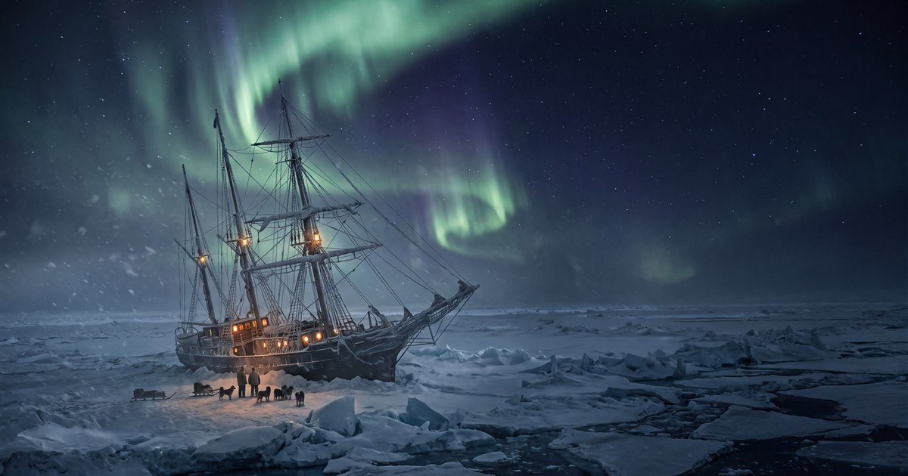

# SOUTH — *an endurance*

**▶ Play it: https://kylefriesmarketing.github.io/south/** · part of [THE SHELF](https://kylefriesmarketing.github.io/games/)

Antarctica, 1915. The ship is dying, the ice is drifting, and twenty-seven men are watching your
face to learn whether they are going to live. **You are the Boss** — and this is the only survival
story in THE SHELF where the win condition is *everyone*.

A branching survival epic after the 1914–16 Imperial Trans-Antarctic Expedition: the crush of the
Endurance, the ice camps, the dogs, the boats, Elephant Island, the 800-mile crossing of the
James Caird, the unmapped traverse of South Georgia — and the four attempts it took to go back
for the rest.

## How it plays

- **The nation's vitals**: HOPE (the master supply — the crew reads it off your face every
  morning, and only you issue it), UNITY (mutiny is one tired sentence agreed with silently),
  STRENGTH (bodies are stores, and the cold keeps perfect books), STORES.
- **The men**: one number, 27. History will ask you about exactly one thing.
- Every beat is real: the two-pound rule and the Bible left on the ice, Hurley's smashed plates
  and the banjo declared *vital mental medicine*, the dogs, McNish's one sentence of defiance,
  the wave that wasn't a cloud, Worsley's four sun-sightings in sixteen days, the slide down the
  ridge in the dark, the fourth presence, and the 6:30 whistle at Stromness.
- Endings range from *the ice wrote the ending* to **All Safe, All Well** — which requires all
  27, a nation still united, and a Boss with hope left to spend.

Vanilla JS, zero dependencies, fully static. Generative WebAudio (wind, sea, ship-groan, a
lantern motif that only rings while Hope holds — and a faint banjo when it's high). AI-generated
cinematic stills with full procedural SVG fallback. `~` opens the Boss's lantern; `m` mutes.
